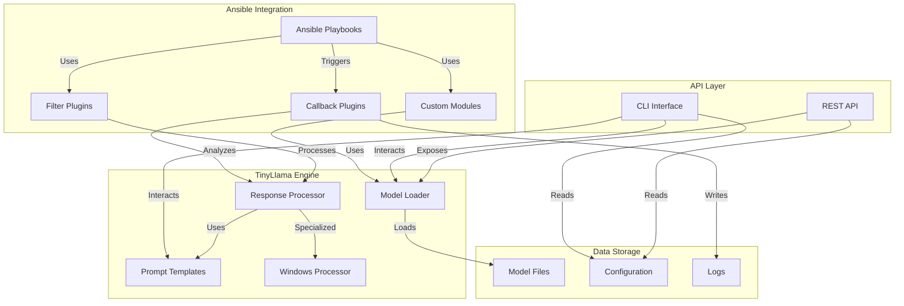
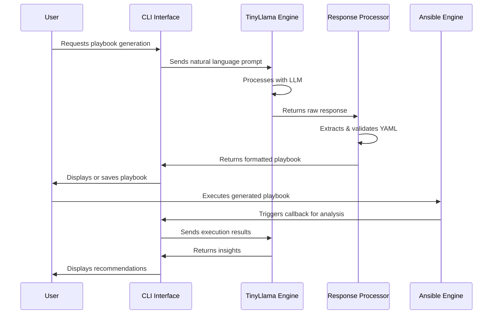

# Ansible-TinyLlama Integration

[](https://www.gnu.org/licenses/gpl-3.0)
[](https://www.python3.org/downloads/release/python3-3120/)
[](https://docs.ansible.com/)

This project integrates TinyLlama 3, a compact large language model (LLM), with the Ansible automation engine to enhance automation capabilities with AI-driven decision making, natural language processing for playbook generation, and intelligent automation workflows.

## Quick Start with Mock Host testing

```bash
# 1. Build containers with sshpass support
docker-compose -f docker-compose.dev.yml build test_runner ansible_llm_api

# 2a. Start Mock Windows testing environment
docker-compose -f docker-compose.dev.yml up -d test_runner ansible_llm_api mock_windows_host

# 2b. Or start Mock Linux testing environment
docker-compose -f docker-compose.dev.yml up -d test_runner ansible_llm_api mock_linux_host

# 2c. Or start both testing environments
docker-compose -f docker-compose.dev.yml up -d test_runner ansible_llm_api mock_windows_host mock_linux_host
```

## Troubleshooting Mock Hosts

If you encounter issues with either the mock Windows or Linux hosts, try these troubleshooting steps:

##### Common Troubleshooting Steps for Both Hosts

1. **Rebuild all containers with the latest updates**:
   ```bash
   docker-compose -f docker-compose.dev.yml build test_runner ansible_llm_api mock_windows_host mock_linux_host
   ```

2. **Recreate the SSH keys**:
   ```bash
   ./dev.sh setup
   ```

3. **Check SSH connectivity** from the test_runner container:
   ```bash
   # For Windows host
   docker-compose -f docker-compose.dev.yml exec test_runner ssh -o StrictHostKeyChecking=no -i /app/tests/mock_windows_host/id_rsa ansible_user@mock_windows_host
   # For Linux host
   docker-compose -f docker-compose.dev.yml exec test_runner ssh -o StrictHostKeyChecking=no -i /app/tests/mock_linux_host/id_rsa ansible_user@mock_linux_host
   ```

##### Troubleshooting Mock Linux Host

1. **Check if the SSH service is running in the Linux container**:
   ```bash
   docker-compose -f docker-compose.dev.yml exec mock_linux_host ps aux | grep sshd
   ```
   You should see sshd running in the foreground (`/usr/sbin/sshd -D -e`).

2. **Verify network connectivity**:
   ```bash
   docker-compose -f docker-compose.dev.yml exec test_runner ping -c 3 mock_linux_host
   ```

3. **Check SSH port availability**:
   ```bash
   docker-compose -f docker-compose.dev.yml exec test_runner nc -zv mock_linux_host 22
   ```

4. **Verify the Linux container has started properly**:
   ```bash
   docker-compose -f docker-compose.dev.yml logs mock_linux_host
   ```
   Look for the message "SSH setup complete, starting SSH daemon in foreground mode".

5. **Check authorized_keys configuration**:
   ```bash
   docker-compose -f docker-compose.dev.yml exec mock_linux_host cat /home/ansible_user/.ssh/authorized_keys
   ```
   
6. **Test basic Ansible connectivity with ping module**:
   ```bash
   docker-compose -f docker-compose.dev.yml exec test_runner ansible -i tests/mock_linux_host/inventory.ini linux -m ping -e ansible_host_key_checking=false
   ```

7. **Check permissions for Ansible temporary directories**:
   ```bash
   docker-compose -f docker-compose.dev.yml exec mock_linux_host ls -la /home/ansible_user/.ansible
   ```
   The .ansible/tmp directory should exist and be owned by ansible_user with 700 permissions.

## Recent Updates

### June 10, 2025

- Added Linux automation examples, roles, and playbooks for comprehensive Linux system management
- Created Linux Common role with system information, package management, security, and user management tasks
- Added Linux System Management and Security Hardening playbooks
- Added Linux processor module for LLM-based Linux automation tasks with distribution detection
- Created advanced integration tests for Linux automation features
- Enhanced the dev.sh script with linux-automation and linux-security commands
- Added mock Linux host for Linux testing scenarios with Ubuntu 22.04
- Updated inventory.ini for Linux host with proper connection parameters
- Added Linux-specific prompt templates for LLM integration
- Enhanced documentation with comprehensive Linux testing and troubleshooting information
- Added sshpass to the test_runner container to support password-based SSH authentication
- Fixed PowerShell path in mock Windows host and inventory files (/opt/microsoft/powershell/7/pwsh)
- Added support for raw module in playbooks to execute PowerShell commands without Python requirements
- Created raw_test_playbook.yml for easy testing of the mock Windows host
- Updated troubleshooting steps for common SSH connection issues

## Features

- **Natural Language to Playbook**: Convert natural language descriptions into Ansible playbooks
- **Playbook Analysis**: Analyze and suggest improvements for existing playbooks
- **Intelligent Error Handling**: Get AI-powered suggestions when playbooks fail
- **Windows over SSH**: Special focus on Windows automation using SSH instead of WinRM
- **Local LLM Processing**: Run the LLM locally without external API dependencies

## Architecture

### Component Diagram



### Sequence Diagram for Playbook Generation



### Deployment Diagram


## Requirements

- python3 3.12+
- Ansible Core 2.14+
- PyTorch 2.0+ or ONNX Runtime
- SSH access to Windows hosts (OpenSSH Server installed)

## Installation

### Development Environment

1. Clone this repository:
   ```bash
   git clone https://github.com/yourusername/ansible-llm.git
   cd ansible-llm
   ```

2. Create and activate a python3 virtual environment:
   ```bash
   python33.12 -m venv venv
   source venv/bin/activate  # On Windows: venv\Scripts\activate
   ```

3. Install dependencies and CLI tools:
   ```bash
<<<<<<< HEAD
   pip install -r requirements.txt
   pip install -r requirements-dev.txt  # For development tools
   pip install -e .  # Install in development mode
=======
   pip3 install -e .
>>>>>>> 8991e3e979b42abc899c6625c1b9fccf56b46070
   ```
   This will make the `ansible-llm` command available in your environment.

4. Download a TinyLlama model:
   ```bash
   python33 -m src.main model download TinyLlama-1.1B-Chat-v1.0
   ```
   See the [Model Management Guide](docs/model_management.md) for more options.

5. Set up configuration:
   ```bash
<<<<<<< HEAD
   cp config/config.toml config/config.local.toml
   # Edit config/config.local.toml with your preferences
   ```

6. (Optional) Set up Windows SSH examples:
   ```bash
   python -m src.main setup-examples --windows
   ```

7. Run system checks to verify requirements:
   ```bash
   python -m src.utils.system_check
   ```

### Using the Installation Script

For a guided installation, you can use the provided installation script:

```bash
./install.sh
```

This script will:
- Check system requirements
- Create a virtual environment
- Install dependencies
- Download a default model
- Set up basic configuration
- Run verification tests

### Docker Development Environment

You can also use Docker for development:

1. Build and start the development container:
   ```bash
   docker-compose up --build
   ```

2. Access the API at http://localhost:8000/docs

3. Run commands within the container:
   ```bash
   docker-compose exec ansible_llm_api python -m src.main cli --help
   ```

4. Run tests in the container:
   ```bash
   docker-compose exec ansible_llm_api pytest
=======
   ansible-llm cli setup-examples --windows
>>>>>>> 8991e3e979b42abc899c6625c1b9fccf56b46070
   ```
   
   After installation, you can use either the module form `python3 -m src.main` or the installed command `ansible-llm`.

## Quick Start

### CLI Usage Examples

```bash
# Starting the CLI Interface (shows available commands)
cd ansible-llm
source venv/bin/activate  # On Windows: venv\Scripts\activate
python33 -m src.main cli
```

### Available CLI Commands

```bash
# Generate an Ansible playbook from natural language
python3 -m src.main cli generate-playbook "Install and configure Nginx on all web servers with rate limiting"

# Save the generated playbook to a file
python3 -m src.main cli generate-playbook "Install and configure Nginx with SSL on web servers" -o nginx_ssl.yml

# Analyze an existing Ansible playbook
python3 -m src.main cli analyze-playbook path/to/playbook.yml

# Analyze an Ansible inventory file
python3 -m src.main cli analyze-inventory path/to/inventory.ini

# Set up Windows SSH automation examples
python3 -m src.main cli setup-examples --windows
```

### Starting the API Server

```bash
cd ansible-llm
source venv/bin/activate  # On Windows: venv\Scripts\activate
python3 -m src.main api --host 0.0.0.0 --port 8000
```

### Managing Models

```bash
<<<<<<< HEAD
# Generate a playbook through CLI
python -m src.main cli generate-playbook "Install and configure Nginx on all web servers with rate limiting"

# Generate a playbook through API (using curl)
curl -X POST "http://localhost:8000/generate_playbook" \
  -H "Content-Type: application/json" \
  -d '{"description": "Install and configure Nginx on all web servers with rate limiting", "target_os": "Linux"}'
```

### Analyzing an Existing Playbook

```bash
# Analyze a playbook through CLI
python -m src.main cli analyze-playbook path/to/playbook.yml

# Analyze a playbook through API (using curl)
curl -X POST "http://localhost:8000/analyze_playbook" \
  -H "Content-Type: application/json" \
  -d '{"playbook": "- name: My playbook\n  hosts: all\n  tasks:\n    - name: Install nginx\n      package:\n        name: nginx\n        state: present"}'
=======
# List available models
python3 -m src.main model list

# Download a specific model
python3 -m src.main model download TinyLlama-1.1B-Chat-v1.0

# Download and quantize a model to reduce memory usage
python3 -m src.main model download TinyLlama-1.1B-Chat-v1.0 --quantize 8bit
>>>>>>> 8991e3e979b42abc899c6625c1b9fccf56b46070
```

### Using Windows SSH Examples

1. Ensure your Windows hosts have OpenSSH Server installed and configured
2. Review the setup guide in `examples/windows_ssh/setup_guide.md`
3. Update the inventory file with your Windows hosts
4. Run the example playbook:
   ```bash
   ansible-playbook -i examples/windows_ssh/inventory.ini examples/windows_ssh/example_playbook.yml
   ```

### Using the LLM Advisor Callback Plugin

Enable the callback plugin in your ansible.cfg:

```ini
[defaults]
callback_plugins = ./src/ansible_plugins/callbacks
callback_whitelist = llm_advisor

[callback_llm_advisor]
enable_failure_analysis = True
enable_optimization = True
```

<<<<<<< HEAD
Then run your playbook with verbosity to see the advisor output:
```bash
ansible-playbook -v your_playbook.yml
```
=======
## Docker Development Environment

A Docker-based development environment is available for easy testing across platforms (Linux, macOS, Windows).

### Prerequisites

- Docker and Docker Compose installed on your system
- Git to clone the repository

### Getting Started with Docker

1. **Setup the development environment**:
   ```bash
   # Clone the repository if you haven't already
   git clone https://github.com/yourusername/ansible-llm.git
   cd ansible-llm
   
   # Make the dev script executable
   chmod +x dev.sh
   
   # Setup test environment (creates SSH keys for mock hosts)
   ./dev.sh setup
   ```

2. **Start the development environment**:
   ```bash
   # Start the API server in development mode
   ./dev.sh start
   ```

3. **Download a model**:
   ```bash
   # List available models
   ./dev.sh model list
   
   # Download a TinyLlama model
   ./dev.sh model download TinyLlama-1.1B-Chat-v1.0
   ```

4. **Run tests**:
   ```bash
   # Run all tests
   ./dev.sh test
   
   # Run integration tests with mock Windows host
   ./dev.sh test-integration
   ```

5. **Access container shell**:
   ```bash
   # Get an interactive shell in the container
   ./dev.sh shell
   ```

6. **Other useful commands**:
   ```bash
   # View logs
   ./dev.sh logs
   
   # Restart the API service
   ./dev.sh restart
   
   # Stop the environment
   ./dev.sh stop
   
   # Clean up everything (including volumes)
   ./dev.sh clean
   ```

### Cross-Platform Considerations

- **Windows**: Use PowerShell or WSL2 to run Docker commands
- **File Permissions**: The container runs as root to avoid permission issues with mounted volumes
- **SSH Keys**: SSH keys for mock hosts are generated in `tests/mock_windows_host/`

### Testing with Mock Windows Host

The development environment includes a mock Windows host with PowerShell Core for testing Windows automation:

```bash
# Quick Start with Mock Windows testing
# 1. Build containers with sshpass support
docker compose -f docker-compose.dev.yml build test_runner ansible_llm_api

# 2. Start all necessary containers
docker compose -f docker-compose.dev.yml up -d test_runner ansible_llm_api mock_windows_host

# 3. Run the sample test playbook
docker compose -f docker-compose.dev.yml exec -u root -e ANSIBLE_HOST_KEY_CHECKING=False test_runner ansible-playbook -i tests/mock_windows_host/inventory.ini tests/mock_windows_host/raw_test_playbook.yml -v

# Run your own custom playbook
docker compose -f docker-compose.dev.yml exec -u root -e ANSIBLE_HOST_KEY_CHECKING=False test_runner ansible-playbook -i tests/mock_windows_host/inventory.ini your_playbook.yml -v
```

#### Mock Windows Host Features

- Runs PowerShell Core 7.x in a Linux container
- Provides SSH access with username 'ansible_user' and password 'ansible_password'
- Simulates a Windows-like environment with PowerShell
- Has Windows-like directory structures (C:\Windows, C:\Program Files, etc.)
- Allows testing of PowerShell scripts via Ansible
- Supports password-based SSH authentication using sshpass

#### Direct SSH Access

You can directly SSH into the mock Windows host for testing:

```bash
# From the test_runner container using password authentication
docker compose -f docker-compose.dev.yml exec test_runner sshpass -p ansible_password ssh -o StrictHostKeyChecking=no ansible_user@mock_windows_host

# Run PowerShell commands directly
docker compose -f docker-compose.dev.yml exec test_runner sshpass -p ansible_password ssh -o StrictHostKeyChecking=no ansible_user@mock_windows_host /opt/microsoft/powershell/7/pwsh -Command "Write-Output 'Hello from PowerShell!'"
```

> **Note**: The PowerShell executable in the mock Windows host is located at `/opt/microsoft/powershell/7/pwsh`. Always specify the full path when running PowerShell commands.

#### Complete Testing Example

A ready-to-use test playbook is included in the repository at `tests/mock_windows_host/raw_test_playbook.yml`. This is the recommended approach for testing PowerShell commands with Ansible:

```yaml
# tests/mock_windows_host/raw_test_playbook.yml
---
- name: Test PowerShell Execution on Mock Windows Host using Raw module
  hosts: windows
  gather_facts: false
  
  tasks:
    - name: Test PowerShell with raw module
      ansible.builtin.raw: /opt/microsoft/powershell/7/pwsh -Command "Write-Output 'Hello from PowerShell on mock Windows host'; Get-Process | Select-Object -First 5"
      register: raw_output
    
    - name: Show raw output
      ansible.builtin.debug:
        var: raw_output.stdout_lines
```

You can run this test playbook with:

```bash
docker compose -f docker-compose.dev.yml exec -u root -e ANSIBLE_HOST_KEY_CHECKING=False test_runner ansible-playbook -i tests/mock_windows_host/inventory.ini tests/mock_windows_host/raw_test_playbook.yml -v
```

> **Important**: Using the `raw` module is recommended for Windows SSH targets as it doesn't rely on Python being available on the target host. For Windows environments, PowerShell is the preferred scripting language.

### Linux Automation Features

The project includes comprehensive Linux automation capabilities with the following components:

#### Linux Processor Module

The `LinuxProcessor` module (`src/llm_engine/linux_processor.py`) integrates with the LLM engine to handle Linux-specific automation tasks:

- Detects Linux distributions and selects appropriate package managers
- Generates Ansible tasks for package management, service control, user management, and firewall configuration
- Processes natural language requests related to Linux automation
- Supports common Linux distributions (Ubuntu, Debian, CentOS, RHEL, Fedora, etc.)

#### Linux Automation Examples

The project includes ready-to-use Linux automation examples:

1. **Linux Common Role** (`src/examples/linux_automation/roles/linux_common/`):
   - System information collection tasks
   - Package management for different Linux distributions
   - User management tasks
   - Security hardening features

2. **Linux System Management Playbook** (`src/examples/linux_automation/linux_system_management.yml`):
   - Demonstrates comprehensive system management
   - Creates system status reports
   - Handles service checks and monitoring

3. **Linux Security Hardening Playbook** (`src/examples/linux_automation/linux_security_hardening.yml`):
   - Implements security best practices for Linux systems
   - Configures SSH hardening
   - Sets up firewall rules
   - Enables automatic security updates

#### Running Linux Automation Examples

You can run the Linux automation examples using the `dev.sh` script:

```bash
# Run the Linux system management playbook
./dev.sh linux-automation

# Run the Linux security hardening playbook
./dev.sh linux-security
```

### Testing with Mock Linux Host

The project includes a mock Linux host for testing Linux automation scenarios:

```bash
# Run the Linux test playbook
docker-compose -f docker-compose.dev.yml exec -u root -e ANSIBLE_HOST_KEY_CHECKING=False test_runner ansible-playbook -i tests/mock_linux_host/inventory.ini tests/mock_linux_host/test_playbook.yml -v
```

#### Mock Linux Host Features

- Runs Ubuntu 22.04 in a container
- Provides SSH access with username 'ansible_user' and password 'ansible_password'
- Has Python 3 pre-installed for Ansible compatibility
- Supports both password-based and key-based SSH authentication
- Includes sudo privileges for the ansible_user
- Configured to work with Ansible's advanced modules
- Includes test directories and files for automation testing

#### Linux Host Inventory Configuration

The mock Linux host uses the following inventory configuration:

```ini
[linux]
mock_linux ansible_host=localhost ansible_port=2223 ansible_user=ansible_user ansible_password=ansible_password ansible_ssh_private_key_file=/app/tests/mock_linux_host/id_rsa

[linux:vars]
ansible_connection=ssh
ansible_python_interpreter=/usr/bin/python3
ansible_become=true
ansible_become_method=sudo
ansible_become_user=root
ansible_ssh_common_args='-o StrictHostKeyChecking=no -o UserKnownHostsFile=/dev/null'
```

Note that the mock Linux host is accessible via localhost on port 2223 when accessing it from outside the Docker network.

#### Direct SSH Access to Mock Linux Host

You can directly SSH into the mock Linux host for testing:

```bash
# From the test_runner container using password authentication
docker-compose -f docker-compose.dev.yml exec test_runner sshpass -p ansible_password ssh -o StrictHostKeyChecking=no ansible_user@mock_linux_host

# Using key-based authentication
docker-compose -f docker-compose.dev.yml exec test_runner ssh -o StrictHostKeyChecking=no -i /app/tests/mock_linux_host/id_rsa ansible_user@mock_linux_host
```

#### Troubleshooting Mock Windows Host

If you encounter issues with the mock Windows host, try these troubleshooting steps:

1. **Rebuild the containers with the latest updates**:
   ```bash
   docker compose -f docker-compose.dev.yml build test_runner ansible_llm_api mock_windows_host
   ```

2. **Check if sshpass is correctly installed in the test_runner container**:
   ```bash
   docker-compose -f docker-compose.dev.yml exec test_runner which sshpass
   ```
   If sshpass is not found, it means there might be an issue with the container build. Check the `Dockerfile.dev` to ensure sshpass is included in the apt-get install commands.

3. **Verify the PowerShell path in the mock Windows host**:
   ```bash
   docker compose -f docker-compose.dev.yml exec mock_windows_host find / -name pwsh -type f 2>/dev/null
   ```
   The path should be `/opt/microsoft/powershell/7/pwsh`. Make sure your inventory files and playbooks use this path.

4. **Test SSH connectivity manually**:
   ```bash
   docker compose -f docker-compose.dev.yml exec test_runner ssh -o StrictHostKeyChecking=no -o UserKnownHostsFile=/dev/null ansible_user@mock_windows_host
   # Password: ansible_password
   ```

5. **Verify PowerShell works in the mock host**:
   ```bash
   docker compose -f docker-compose.dev.yml exec mock_windows_host /opt/microsoft/powershell/7/pwsh -Command "Write-Output 'Test'"
   ```

6. **Check inventory file configuration**:
   Ensure the inventory file for the mock Windows host has the correct settings:
   ```ini
   [windows]
   mock_windows ansible_host=mock_windows_host ansible_port=22 ansible_user=ansible_user ansible_password=ansible_password
   
   [windows:vars]
   ansible_connection=ssh
   ansible_shell_type=powershell
   ansible_shell_executable=/opt/microsoft/powershell/7/pwsh
   ansible_become=false
   ```

### Linux Integration Tests

The project includes comprehensive integration tests for Linux functionality:

#### Basic Linux Integration Tests

Basic integration tests (`tests/integration/test_linux_integration.py`) verify core Linux host functionality:
- SSH connectivity to the mock Linux host
- Running Ansible ping module against the Linux host
- Gathering facts from the Linux host
- Executing commands via Ansible
- Running playbooks against the Linux host

#### Advanced Linux Integration Tests

Advanced integration tests (`tests/integration/test_linux_advanced.py`) verify more complex Linux automation:
- Running the Linux system management playbook
- Testing the Linux security hardening playbook
- Testing the linux_common role
- Package installation tests
- File operation tests

#### Linux Processor Tests

The Linux processor tests (`tests/integration/test_linux_processor.py`) verify the LLM integration:
- Testing the distribution detection functionality
- Generating package management tasks
- Generating service control tasks
- Testing user management task generation
- Testing firewall configuration
- LLM request processing for Linux automation

Running the integration tests:
```bash
# Run all integration tests
./dev.sh test-integration

# Run the basic Linux test playbook
./dev.sh test-linux
```

## Recent Updates

### June 2025

- Added sshpass to the test_runner container to support password-based SSH authentication with Ansible
- Fixed PowerShell path in mock Windows host and inventory files (/opt/microsoft/powershell/7/pwsh)
- Added support for raw module in playbooks to execute PowerShell commands without python3 requirements 
- Enhanced documentation for working with the mock Windows host
- Added example playbooks for quick testing and validation
- Created raw_test_playbook.yml for easy testing of the mock Windows host
- Updated troubleshooting steps for common SSH connection issues

## Development

This project is in active development. The implementation follows the phases outlined in the specification document:

1. **Phase 1: Foundation** (Current Phase)
   - Basic integration between Ansible and TinyLlama 3
   - Simple playbook generation from natural language
   - Initial template library

2. **Phase 2: Enhancement** (Upcoming)
   - Advanced decision-making during playbook execution
   - Infrastructure analysis and recommendations
   - Performance optimizations

3. **Phase 3: Advanced Features** (Planned)
   - Learning from execution results to improve future automations
   - Multi-model support (alternative LLMs)
   - Advanced security features and compliance checking

## Security Considerations

- The LLM never has direct access to Ansible Vault or credentials
- All LLM processing happens locally by default
- Comprehensive logging of all LLM-generated content
- Optional human approval for LLM-generated playbooks before execution

## License

GNU General Public License v3.0
>>>>>>> 8991e3e979b42abc899c6625c1b9fccf56b46070

## Development Workflow

1. **Fork and Clone the Repository**
   ```bash
   git clone https://github.com/yourusername/ansible-llm.git
   cd ansible-llm
   ```

2. **Create a Branch**
   ```bash
   git checkout -b feature/your-feature-name
   ```

3. **Make Changes and Test**
   ```bash
   # Implement your changes
   # Run tests (to be implemented)
   ```

4. **Commit and Push**
   ```bash
   git add .
   git commit -m "Add your detailed commit message"
   git push origin feature/your-feature-name
   ```

5. **Create a Pull Request**
   - Open a PR against the main branch
   - Describe your changes in detail
   - Link any related issues

## Testing and CI/CD

### Running Tests

```bash
# Run all tests
pytest

# Run specific test modules
pytest tests/unit/

# Run with coverage report
pytest --cov=src --cov-report=term-missing
```

### Test Structure

- **Unit Tests**: Test individual components in isolation
  ```bash
  pytest tests/unit/
  ```

- **Integration Tests**: Test component interactions
  ```bash
  pytest tests/integration/
  ```

- **Functional Tests**: Test full features end-to-end
  ```bash
  pytest tests/functional/
  ```

### Continuous Integration

The project uses GitHub Actions for CI/CD:

- **Pull Requests**: Automatically runs tests, linting, and security checks
- **Main Branch**: Runs tests and builds Docker images
- **Tags (v*)**: Builds and publishes Docker images to registry

You can view the CI/CD workflows in the `.github/workflows` directory.

### Linting and Code Quality

```bash
# Format code with Black
black src/ tests/

# Sort imports with isort
isort src/ tests/

# Run flake8 for linting
flake8 src/ tests/

# Run all pre-commit hooks
pre-commit run --all-files
```

## Contributing

Contributions are welcome! Please feel free to submit a Pull Request.

1. Fork the project
2. Create your feature branch (`git checkout -b feature/amazing-feature`)
3. Commit your changes (`git commit -m 'Add some amazing feature'`)
4. Push to the branch (`git push origin feature/amazing-feature`)
5. Open a Pull Request

## Troubleshooting and FAQ

### Common Issues

#### Model Loading Failures

**Problem**: Error when loading the TinyLlama model
```
Error loading model: No such file or directory
```

**Solution**: 
- Ensure you've downloaded the model using the provided script
- Check the MODEL_PATH environment variable or configuration setting
- Verify the model name in config matches the downloaded model

#### Memory Issues

**Problem**: Out of memory errors when loading the model

**Solution**: 
- Use quantization by setting `quantization = "4bit"` in config
- Increase system RAM or use swap space
- Try a smaller model variant

#### Windows SSH Connection Issues

**Problem**: Cannot connect to Windows hosts via SSH

**Solution**: 
- Verify OpenSSH Server is properly installed on Windows hosts
- Check firewall settings to ensure port 22 is open
- Ensure the user has admin rights on the Windows system
- See detailed troubleshooting in `examples/windows_ssh/WINDOWS_SSH_QUICKSTART.md`

### FAQ

**Q: How do I use a different TinyLlama model?**

A: You can download alternative models using the script:
```bash
./models/download_models.sh download alternate-model-name
```
Then update the `model_name` in your config file.

**Q: Can I run this without GPU acceleration?**

A: Yes, the system works on CPU-only environments, but will be significantly slower. Using quantization (`quantization = "4bit"`) can help improve performance.

**Q: How do I configure the API for HTTPS?**

A: The recommended approach is to use a reverse proxy like Nginx or Traefik to handle SSL termination. See the Production Deployment section for details.

**Q: How do I integrate this with my existing Ansible environment?**

A: You can use the custom modules and plugins by adding their paths to your ansible.cfg. See the documentation in `docs/` for detailed integration guides.

## Versioning and Changelog

This project follows [Semantic Versioning](https://semver.org/). For the versions available, see the [tags on this repository](https://github.com/yourusername/ansible-llm/tags).

For a detailed changelog, see the [CHANGELOG.md](CHANGELOG.md) file.

## License

GNU General Public License v3.0
