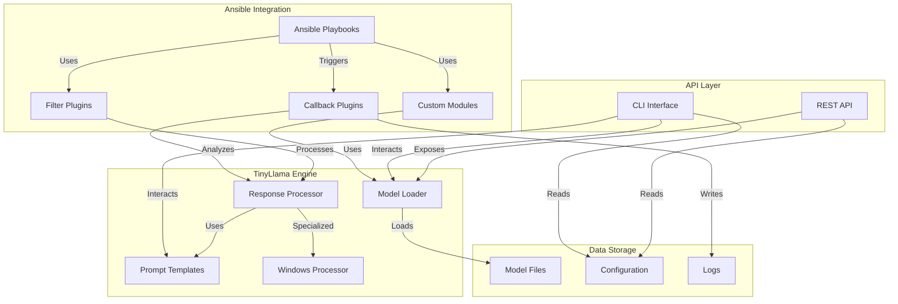
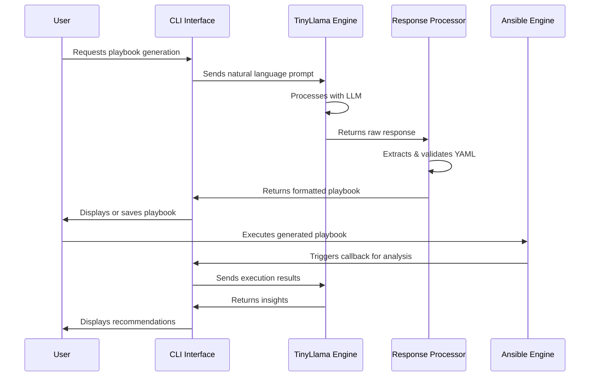
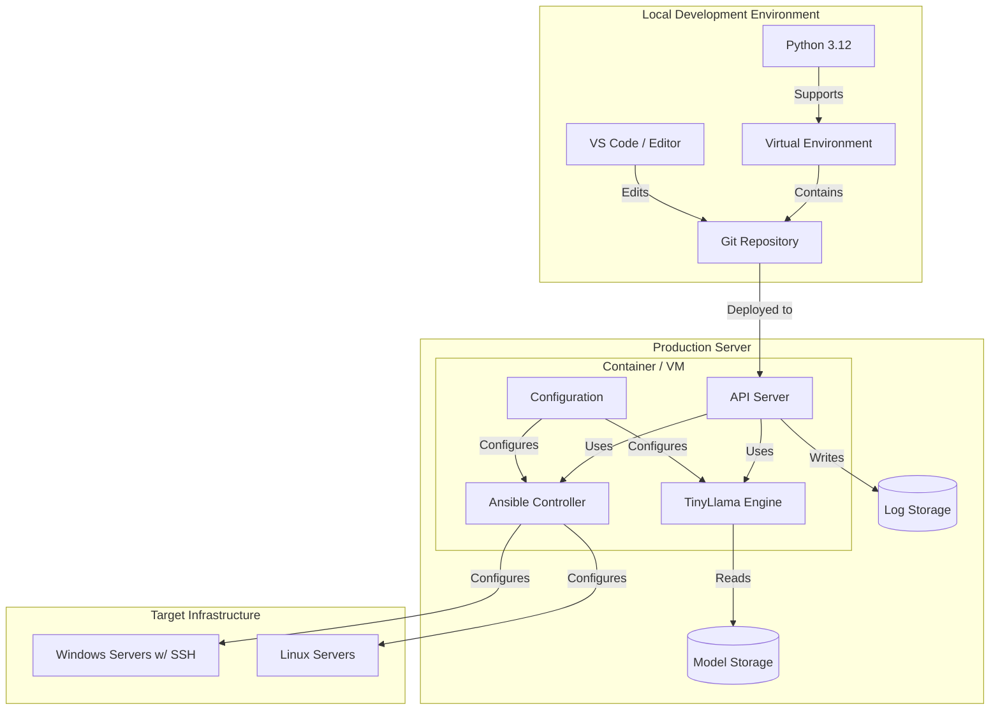

# Ansible-TinyLlama Integration

[](https://www.gnu.org/licenses/gpl-3.0)
[](https://www.python.org/downloads/release/python-3120/)
[](https://docs.ansible.com/)

This project integrates TinyLlama 3, a compact large language model (LLM), with the Ansible automation engine to enhance automation capabilities with AI-driven decision making, natural language processing for playbook generation, and intelligent automation workflows.

## Features

- **Natural Language to Playbook**: Convert natural language descriptions into Ansible playbooks
- **Playbook Analysis**: Analyze and suggest improvements for existing playbooks
- **Intelligent Error Handling**: Get AI-powered suggestions when playbooks fail
- **Windows over SSH**: Special focus on Windows automation using SSH instead of WinRM
- **Local LLM Processing**: Run the LLM locally without external API dependencies

## Architecture

### Component Diagram



### Sequence Diagram for Playbook Generation



### Deployment Diagram



## Requirements

- Python 3.12+
- Ansible Core 2.14+
- PyTorch 2.0+ or ONNX Runtime
- SSH access to Windows hosts (OpenSSH Server installed)

## Installation

1. Clone this repository:
   ```bash
   git clone https://github.com/yourusername/ansible-llm.git
   cd ansible-llm
   ```

2. Create and activate a Python virtual environment:
   ```bash
   python3.12 -m venv venv
   source venv/bin/activate  # On Windows: venv\Scripts\activate
   ```

3. Install dependencies and CLI tools:
   ```bash
   pip install -e .
   ```
   This will make the `ansible-llm` command available in your environment.

4. Download a TinyLlama model:
   ```bash
   python -m src.main model download TinyLlama-1.1B-Chat-v1.0
   ```
   See the [Model Management Guide](docs/model_management.md) for more options.

5. (Optional) Set up Windows SSH examples:
   ```bash
   ansible-llm cli setup-examples --windows
   ```
   
   After installation, you can use either the module form `python -m src.main` or the installed command `ansible-llm`.

## Quick Start

### CLI Usage Examples

```bash
# Starting the CLI Interface (shows available commands)
cd ansible-llm
source venv/bin/activate  # On Windows: venv\Scripts\activate
python -m src.main cli
```

### Available CLI Commands

```bash
# Generate an Ansible playbook from natural language
python -m src.main cli generate-playbook "Install and configure Nginx on all web servers with rate limiting"

# Save the generated playbook to a file
python -m src.main cli generate-playbook "Install and configure Nginx with SSL on web servers" -o nginx_ssl.yml

# Analyze an existing Ansible playbook
python -m src.main cli analyze-playbook path/to/playbook.yml

# Analyze an Ansible inventory file
python -m src.main cli analyze-inventory path/to/inventory.ini

# Set up Windows SSH automation examples
python -m src.main cli setup-examples --windows
```

### Starting the API Server

```bash
cd ansible-llm
source venv/bin/activate  # On Windows: venv\Scripts\activate
python -m src.main api --host 0.0.0.0 --port 8000
```

### Managing Models

```bash
# List available models
python -m src.main model list

# Download a specific model
python -m src.main model download TinyLlama-1.1B-Chat-v1.0

# Download and quantize a model to reduce memory usage
python -m src.main model download TinyLlama-1.1B-Chat-v1.0 --quantize 8bit
```

### Using Windows SSH Examples

1. Ensure your Windows hosts have OpenSSH Server installed and configured
2. Review the setup guide in `examples/windows_ssh/setup_guide.md`
3. Update the inventory file with your Windows hosts
4. Run the example playbook:
   ```bash
   ansible-playbook -i examples/windows_ssh/inventory.ini examples/windows_ssh/example_playbook.yml
   ```

## Project Structure

```
ansible-llm/
├── config/               # Configuration directory
│   └── config.toml       # Main configuration file
├── docs/                 # Documentation
│   └── ansible-llm-integration-spec.md
├── examples/             # Example playbooks for users
│   └── windows_ssh/      # Windows SSH examples
├── logs/                 # Log files directory
├── models/               # TinyLlama model files directory
├── src/                  # Source code
│   ├── ansible_plugins/  # Custom Ansible plugins
│   │   ├── callbacks/    # Callback plugins
│   │   ├── filters/      # Filter plugins
│   │   └── modules/      # Custom modules
│   ├── api/              # API interfaces
│   │   ├── cli.py        # Command line interface
│   │   └── rest_api.py   # REST API
│   ├── llm_engine/       # TinyLlama integration
│   │   ├── model_loader.py
│   │   ├── prompt_templates.py
│   │   ├── response_processor.py
│   │   └── windows_processor.py
│   ├── main.py           # Main entry point
│   └── utils/            # Utilities
│       └── logger.py     # Logging setup
└── setup.py              # Setup script

## Development

This project is in active development. The implementation follows the phases outlined in the specification document:

1. **Phase 1: Foundation** (Current Phase)
   - Basic integration between Ansible and TinyLlama 3
   - Simple playbook generation from natural language
   - Initial template library

2. **Phase 2: Enhancement** (Upcoming)
   - Advanced decision-making during playbook execution
   - Infrastructure analysis and recommendations
   - Performance optimizations

3. **Phase 3: Advanced Features** (Planned)
   - Learning from execution results to improve future automations
   - Multi-model support (alternative LLMs)
   - Advanced security features and compliance checking

## Security Considerations

- The LLM never has direct access to Ansible Vault or credentials
- All LLM processing happens locally by default
- Comprehensive logging of all LLM-generated content
- Optional human approval for LLM-generated playbooks before execution

## License

GNU General Public License v3.0

## Development Workflow

1. **Fork and Clone the Repository**
   ```bash
   git clone https://github.com/yourusername/ansible-llm.git
   cd ansible-llm
   ```

2. **Create a Branch**
   ```bash
   git checkout -b feature/your-feature-name
   ```

3. **Make Changes and Test**
   ```bash
   # Implement your changes
   # Run tests (to be implemented)
   ```

4. **Commit and Push**
   ```bash
   git add .
   git commit -m "Add your detailed commit message"
   git push origin feature/your-feature-name
   ```

5. **Create a Pull Request**
   - Open a PR against the main branch
   - Describe your changes in detail
   - Link any related issues

## Contributing

Contributions are welcome! Please feel free to submit a Pull Request.

1. Fork the project
2. Create your feature branch (`git checkout -b feature/amazing-feature`)
3. Commit your changes (`git commit -m 'Add some amazing feature'`)
4. Push to the branch (`git push origin feature/amazing-feature`)
5. Open a Pull Request
