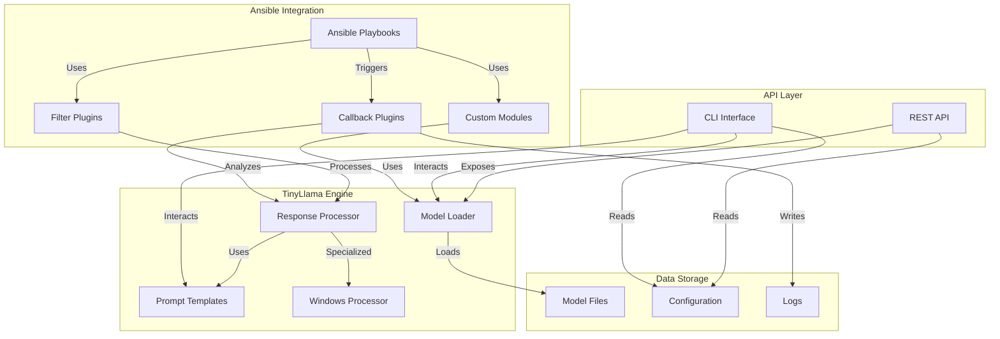
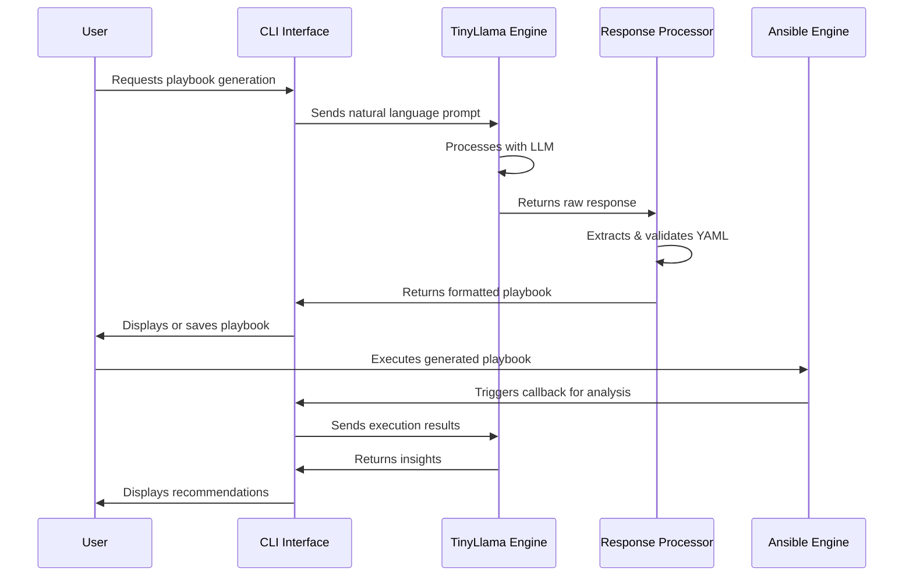
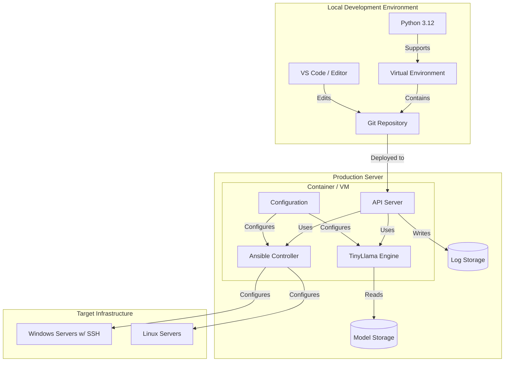

# Ansible-TinyLlama Integration

[](https://www.gnu.org/licenses/gpl-3.0)
[](https://www.python.org/downloads/release/python-3120/)
[](https://docs.ansible.com/)

This project integrates TinyLlama 3, a compact large language model (LLM), with the Ansible automation engine to enhance automation capabilities with AI-driven decision making, natural language processing for playbook generation, and intelligent automation workflows.

## Features

- **Natural Language to Playbook**: Convert natural language descriptions into Ansible playbooks
- **Playbook Analysis**: Analyze and suggest improvements for existing playbooks
- **Intelligent Error Handling**: Get AI-powered suggestions when playbooks fail
- **Windows over SSH**: Special focus on Windows automation using SSH instead of WinRM
- **Local LLM Processing**: Run the LLM locally without external API dependencies

## Architecture

### Component Diagram



### Sequence Diagram for Playbook Generation



### Deployment Diagram



## Requirements

- Python 3.12+
- Ansible Core 2.14+
- PyTorch 2.0+ or ONNX Runtime
- SSH access to Windows hosts (OpenSSH Server installed)

## Installation

### Development Environment

1. Clone this repository:
   ```bash
   git clone https://github.com/yourusername/ansible-llm.git
   cd ansible-llm
   ```

2. Create and activate a Python virtual environment:
   ```bash
   python3.12 -m venv venv
   source venv/bin/activate  # On Windows: venv\Scripts\activate
   ```

3. Install dependencies:
   ```bash
   pip install -r requirements.txt
   pip install -r requirements-dev.txt  # For development tools
   pip install -e .  # Install in development mode
   ```

4. Download a TinyLlama model:
   ```bash
   ./models/download_models.sh download tinyllama-1.1b-chat
   ```
   See the [Model Management Guide](docs/model_management.md) for more options.

5. Set up configuration:
   ```bash
   cp config/config.toml config/config.local.toml
   # Edit config/config.local.toml with your preferences
   ```

6. (Optional) Set up Windows SSH examples:
   ```bash
   python -m src.main setup-examples --windows
   ```

7. Run system checks to verify requirements:
   ```bash
   python -m src.utils.system_check
   ```

### Using the Installation Script

For a guided installation, you can use the provided installation script:

```bash
./install.sh
```

This script will:
- Check system requirements
- Create a virtual environment
- Install dependencies
- Download a default model
- Set up basic configuration
- Run verification tests

### Docker Development Environment

You can also use Docker for development:

1. Build and start the development container:
   ```bash
   docker-compose up --build
   ```

2. Access the API at http://localhost:8000/docs

3. Run commands within the container:
   ```bash
   docker-compose exec ansible_llm_api python -m src.main cli --help
   ```

4. Run tests in the container:
   ```bash
   docker-compose exec ansible_llm_api pytest
   ```

## Quick Start

### Starting the CLI Interface

```bash
cd ansible-llm
source venv/bin/activate  # On Windows: venv\Scripts\activate
python -m src.main cli
```

### Starting the API Server

```bash
cd ansible-llm
source venv/bin/activate  # On Windows: venv\Scripts\activate
python -m src.main api --host 0.0.0.0 --port 8000
```

### Generating a Playbook

```bash
# Generate a playbook through CLI
python -m src.main cli generate-playbook "Install and configure Nginx on all web servers with rate limiting"

# Generate a playbook through API (using curl)
curl -X POST "http://localhost:8000/generate_playbook" \
  -H "Content-Type: application/json" \
  -d '{"description": "Install and configure Nginx on all web servers with rate limiting", "target_os": "Linux"}'
```

### Analyzing an Existing Playbook

```bash
# Analyze a playbook through CLI
python -m src.main cli analyze-playbook path/to/playbook.yml

# Analyze a playbook through API (using curl)
curl -X POST "http://localhost:8000/analyze_playbook" \
  -H "Content-Type: application/json" \
  -d '{"playbook": "- name: My playbook\n  hosts: all\n  tasks:\n    - name: Install nginx\n      package:\n        name: nginx\n        state: present"}'
```

### Using Windows SSH Examples

1. Ensure your Windows hosts have OpenSSH Server installed and configured
2. Review the setup guide in `examples/windows_ssh/setup_guide.md`
3. Update the inventory file with your Windows hosts
4. Run the example playbook:
   ```bash
   ansible-playbook -i examples/windows_ssh/inventory.ini examples/windows_ssh/example_playbook.yml
   ```

### Using the LLM Advisor Callback Plugin

Enable the callback plugin in your ansible.cfg:

```ini
[defaults]
callback_plugins = ./src/ansible_plugins/callbacks
callback_whitelist = llm_advisor

[callback_llm_advisor]
enable_failure_analysis = True
enable_optimization = True
```

Then run your playbook with verbosity to see the advisor output:
```bash
ansible-playbook -v your_playbook.yml
```

## Development Workflow

1. **Fork and Clone the Repository**
   ```bash
   git clone https://github.com/yourusername/ansible-llm.git
   cd ansible-llm
   ```

2. **Create a Branch**
   ```bash
   git checkout -b feature/your-feature-name
   ```

3. **Make Changes and Test**
   ```bash
   # Implement your changes
   # Run tests (to be implemented)
   ```

4. **Commit and Push**
   ```bash
   git add .
   git commit -m "Add your detailed commit message"
   git push origin feature/your-feature-name
   ```

5. **Create a Pull Request**
   - Open a PR against the main branch
   - Describe your changes in detail
   - Link any related issues

## Testing and CI/CD

### Running Tests

```bash
# Run all tests
pytest

# Run specific test modules
pytest tests/unit/

# Run with coverage report
pytest --cov=src --cov-report=term-missing
```

### Test Structure

- **Unit Tests**: Test individual components in isolation
  ```bash
  pytest tests/unit/
  ```

- **Integration Tests**: Test component interactions
  ```bash
  pytest tests/integration/
  ```

- **Functional Tests**: Test full features end-to-end
  ```bash
  pytest tests/functional/
  ```

### Continuous Integration

The project uses GitHub Actions for CI/CD:

- **Pull Requests**: Automatically runs tests, linting, and security checks
- **Main Branch**: Runs tests and builds Docker images
- **Tags (v*)**: Builds and publishes Docker images to registry

You can view the CI/CD workflows in the `.github/workflows` directory.

### Linting and Code Quality

```bash
# Format code with Black
black src/ tests/

# Sort imports with isort
isort src/ tests/

# Run flake8 for linting
flake8 src/ tests/

# Run all pre-commit hooks
pre-commit run --all-files
```

## Contributing

Contributions are welcome! Please feel free to submit a Pull Request.

1. Fork the project
2. Create your feature branch (`git checkout -b feature/amazing-feature`)
3. Commit your changes (`git commit -m 'Add some amazing feature'`)
4. Push to the branch (`git push origin feature/amazing-feature`)
5. Open a Pull Request

## Troubleshooting and FAQ

### Common Issues

#### Model Loading Failures

**Problem**: Error when loading the TinyLlama model
```
Error loading model: No such file or directory
```

**Solution**: 
- Ensure you've downloaded the model using the provided script
- Check the MODEL_PATH environment variable or configuration setting
- Verify the model name in config matches the downloaded model

#### Memory Issues

**Problem**: Out of memory errors when loading the model

**Solution**: 
- Use quantization by setting `quantization = "4bit"` in config
- Increase system RAM or use swap space
- Try a smaller model variant

#### Windows SSH Connection Issues

**Problem**: Cannot connect to Windows hosts via SSH

**Solution**: 
- Verify OpenSSH Server is properly installed on Windows hosts
- Check firewall settings to ensure port 22 is open
- Ensure the user has admin rights on the Windows system
- See detailed troubleshooting in `examples/windows_ssh/WINDOWS_SSH_QUICKSTART.md`

### FAQ

**Q: How do I use a different TinyLlama model?**

A: You can download alternative models using the script:
```bash
./models/download_models.sh download alternate-model-name
```
Then update the `model_name` in your config file.

**Q: Can I run this without GPU acceleration?**

A: Yes, the system works on CPU-only environments, but will be significantly slower. Using quantization (`quantization = "4bit"`) can help improve performance.

**Q: How do I configure the API for HTTPS?**

A: The recommended approach is to use a reverse proxy like Nginx or Traefik to handle SSL termination. See the Production Deployment section for details.

**Q: How do I integrate this with my existing Ansible environment?**

A: You can use the custom modules and plugins by adding their paths to your ansible.cfg. See the documentation in `docs/` for detailed integration guides.

## Versioning and Changelog

This project follows [Semantic Versioning](https://semver.org/). For the versions available, see the [tags on this repository](https://github.com/yourusername/ansible-llm/tags).

For a detailed changelog, see the [CHANGELOG.md](CHANGELOG.md) file.

## License

GNU General Public License v3.0
